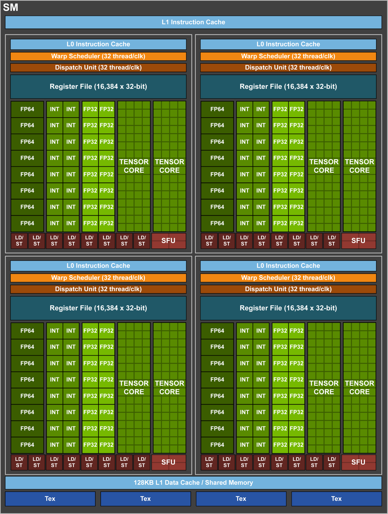

## Thread Blocks
1. Virtual construct 
2. Contains threads
3. can be 1d, 2d, 3d. 
4. shared memory and synchronization can be made between threads. 
5. Code had to be written such that blocks could executed in parallel. (**NOT TRUE NOW DUE TO THREAD BLOCK CLUSTERS**)

## Thread Block clusters
1. Introduced after [Compute Capability 9.0](https://docs.nvidia.com/cuda/cuda-c-programming-guide/index.html#compute-capability-9-0)
2. As threads on thread block guaranteed to be co-scheduled, similarly **thread blocks on thread block clusters can be co-scheduled**
3. At max 8 thread blocks allowed in a cluster. 

```cpp
// In this case passing second argument to <<<>>> is illegal 
// as now entire thread blocks are clusters (one bigger unit as shared memory)

// Implementation detail of how many threads per block and blocks per cluster
// is handled as an attribute of the kernel.
__block_size__((1024, 1, 1), (2, 2, 2)) __global__ void foo();

// 8x8x8 clusters.
// as __block_size__ has 2 arguments, 
// this argument now considered as no of clusters not as no 
// of clusters
foo<<<dim3(8, 8, 8)>>>();
```

## Streaming multiprocessor
1. **Physical construct**
2. Structure: 

