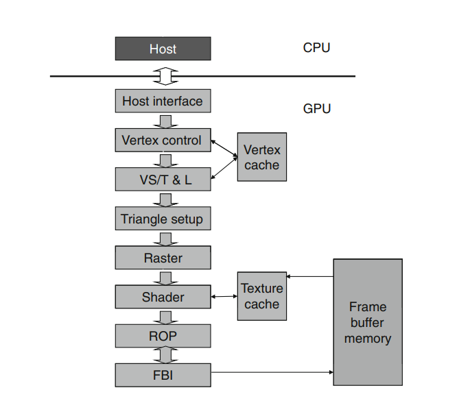

## Thread Blocks
1. Virtual construct 
2. Contains threads
3. can be 1d, 2d, 3d. 
4. shared memory and synchronization can be made between threads. 
5. Code had to be written such that blocks could executed in parallel. (**NOT TRUE NOW DUE TO THREAD BLOCK CLUSTERS**)

## Thread Block clusters
1. Introduced after [Compute Capability 9.0](https://docs.nvidia.com/cuda/cuda-c-programming-guide/index.html#compute-capability-9-0)
2. As threads on thread block guaranteed to be co-scheduled, similarly **thread blocks on thread block clusters can be co-scheduled**
3. At max 8 thread blocks allowed in a cluster. 

```cpp
// In this case passing second argument to <<<>>> is illegal 
// as now entire thread blocks are clusters (one bigger unit as shared memory)

// Implementation detail of how many threads per block and blocks per cluster
// is handled as an attribute of the kernel.
__block_size__((1024, 1, 1), (2, 2, 2)) __global__ void foo();

// 8x8x8 clusters.
// as __block_size__ has 2 arguments, 
// this argument now considered as no of clusters not as no 
// of clusters
foo<<<dim3(8, 8, 8)>>>();
```

## Streaming multiprocessor
1. **Physical construct**
2. Structure: 

## Warps 
1. Hardware scheduling units. 
2. Warp is of 32 threads. 
3. A thread block of `dim = 32 x 32` is optimal as it inherently considers warps. 
4. Threads in block are linearly ordered in row major order **row-major-order**

## [Memory banks](https://leimao.github.io/blog/CUDA-Shared-Memory-Bank/) 
1. Shared memory divided into banks. 
2. Memory access divided over n banks can be parallelized. But memory access over same bank is serialized. 
3. **Important exception: When multiple threads in warp address same shared memory location, resulting in <i>broadcast</i>.** 
4. If different threads in a warp access different banks, then there is multicast transaction, so each bank delivers its value to requesting threads at same time. **This is true for warps only** 
5. Memory address to memory bank mapping is architecture specific. 
6. On devices with compute capability >= 5.x 
   1. Each bank bandwidth => 32 bits / clock-cycle
   2. successive 32 bit words assigned to successive banks.
   3. Warp size => 32 , # of banks => 32 (so conflicts bound to occur)
7. **When warps access different addresses in same bank, the access is serialized. If they access same address (same bank) then value is broadcasted. **

## Some useful information
1. Nvidia graphics pipeline: 